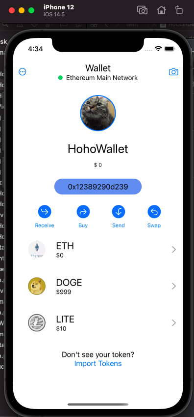
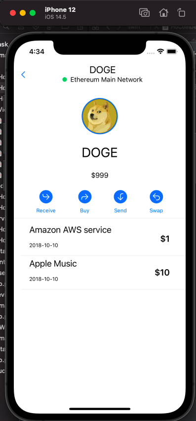
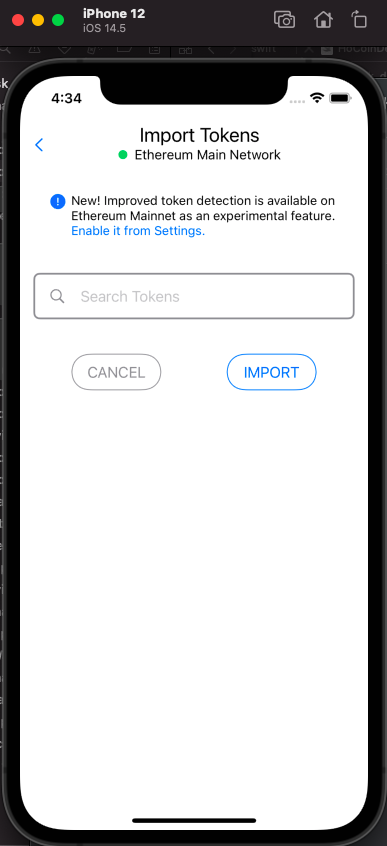
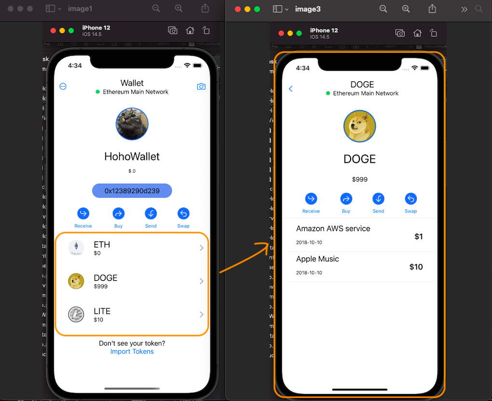
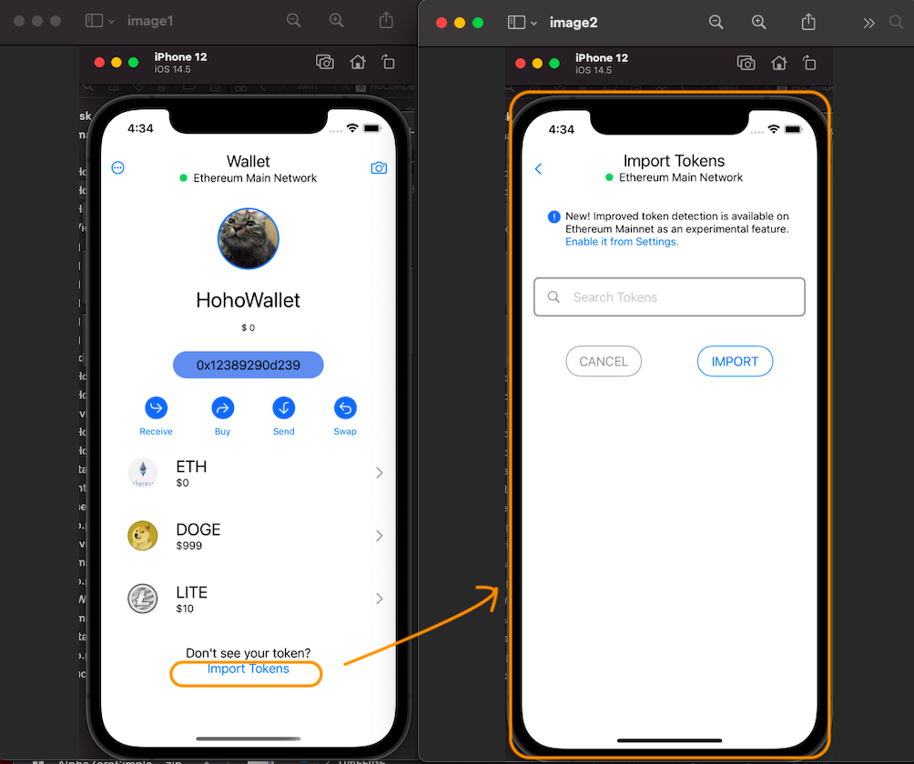

# Metamask_demo

This is a demo project like metamask application. It has been tested on 3 types iPhone (simulator) of iPhone SE (2nd generation), iPhone 12 and iPhone 12 Pro.

### Requirement

* iOS 14.0 or later
* Xcode 12.0 or later

### Data structure

The project mainly has two data model: wallet and coin.

* The wallet model has structure such as below:

```
{
  "accountId": "0x12389290d239",
  "accountName": "HohoWallet",
  "accountIcon": "https://avatars.githubusercontent.com/u/1279449?s=400&u=e81d6d9384a279faba5ba8ef5d6ff55d286ad6ba&v=4",
  "accountBalance": 0,
  "coins": [
    {
      "coinId": 110,
      "icon": "https://bkimg.cdn.bcebos.com/pic/9a504fc2d5628535daa1dba19cef76c6a6ef63e8?x-bce-process=image/resize,m_lfit,w_536,limit_1/format,f_jpg",
      "name": "ETH",
      "balance": 0
    },
    {
      "coinId": 111,
      "icon": "https://bkimg.cdn.bcebos.com/pic/10dfa9ec8a13632717785b9a9b8fa0ec09fac786?x-bce-process=image/resize,m_lfit,w_536,limit_1/format,f_jpg",
      "name": "DOGE",
      "balance": 999
    },
    {
      "coinId": 112,
      "icon": "https://bkimg.cdn.bcebos.com/pic/6609c93d70cf3bc78be052c4d300baa1cd112a31?x-bce-process=image/resize,m_lfit,w_536,limit_1/format,f_jpg",
      "name": "LITE",
      "balance": 10
    }
  ]
}
```

It can be checked in this mock api from the server: 
[http://rap2api.taobao.org/app/mock/data/2267369](http://rap2api.taobao.org/app/mock/data/2267369)


* The coin model such as below:

```
{
  "coinId": 111,
  "name": "DOGE",
  "icon": "https://bkimg.cdn.bcebos.com/pic/10dfa9ec8a13632717785b9a9b8fa0ec09fac786?x-bce-process=image/resize,m_lfit,w_536,limit_1/format,f_jpg",
  "transactions": [
    {
      "tradeId": 123,
      "time": 1652950078,
      "amount": 1,
      "desc": "Amazon AWS service"
    },
    {
      "tradeId": 124,
      "time": 1653090078,
      "amount": 10,
      "desc": "Apple Music"
    }
  ],
  "balance": 999
}
```

And it can be checked in this mock api from the server: 
[http://rap2api.taobao.org/app/mock/data/2267425](http://rap2api.taobao.org/app/mock/data/2267425)

### Feature

Currently, the application only has three pages.

* Wallet home page:



* Coin detail page:



* Coin Adding page:



It only retrieves content from a server for data presentation. You can check these by following instruction:

1. After application launch, it will stay at wallet home page.


2. Click the coin list item, then coin detail page will be pushed.



3. Return to wallet home page, click "Import tokens" in the last list item, then coin adding page will be presented.




### Others

The development log can be seen here:
[https://docs.qq.com/sheet/DUHVick1xVmtTYkh1](https://docs.qq.com/sheet/DUHVick1xVmtTYkh1)